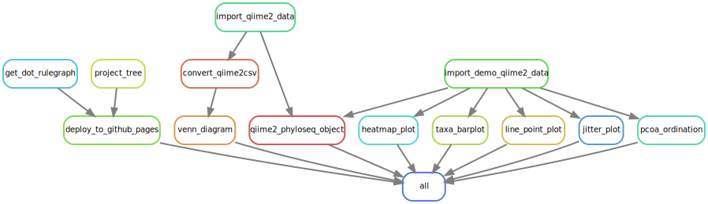

<div id="main-container">

<link rel="preconnect" href="https://fonts.googleapis.com">
<link rel="preconnect" href="https://fonts.gstatic.com" crossorigin>
<link href="https://fonts.googleapis.com/css2?family=Anton" rel="stylesheet">
<link href="https://fonts.googleapis.com/css2?family=Roboto:wght@100;300;400;500;700,900&display=swap" rel="stylesheet">
<link href="https://fonts.googleapis.com/css2?family=Oswald:wght@300;400;700&display=swap" rel="stylesheet">
<link href="https://fonts.googleapis.com/css2?family=Merriweather:wght@300;400;700&display=swap" rel="stylesheet">
<link href="https://fonts.googleapis.com/css2?family=Montserrat:wght@100;200;300;400;700&display=swap" rel="stylesheet">

```{r globalsetup, echo=FALSE, message=FALSE, warning=FALSE}
knitr::opts_chunk$set(
  echo  =FALSE,
  message  =FALSE,
  warning  =FALSE,
  cache  =FALSE,
  comment  =NA,
  fig.path='./figures/',
  fig.show='asis',
  dev  ='png',
  fig.align='center',
  out.width  ="70%",
  fig.width  =7,
  fig.asp  =0.7,
  fig.show  ="asis"
)
suppressPackageStartupMessages(library(tidyverse))
library(schtools)
library(tools)
library(yaml)
library(rhdf5)
library(Matrix)
library(qiime2R)
library(microViz)
library(vegan)
library(phyloseq)

load("data/processed_objects.rda", verbose=TRUE)
```

```{css}
body h2 { margin-top: 1.8em; font-size: 2.0em; color: rgb(77, 148, 248);}
body h2 { margin-top: 1.8em; font-size: 2.0em;}
body h3 { margin-top: 1.8em; font-size: 1.6em; }
body h4 { margin-top: 1.8em; font-size: 1.2em; }
body h5 { margin-top: 1.8em; font-size: 1em; }
```


# Microbiome Data Visualization


## Overview of Snakemake workflow

<br>
<br>




# Heatmaps


## Using `qiime2R`
```{r}
metadata<-read_q2metadata("data/sample_metadata.tsv")
ASVs<-read_qza("data/feature_table.qza")$data
taxonomy<-read_qza("data/taxonomy.qza")$data %>% parse_taxonomy()

taxasums<-summarize_taxa(ASVs, taxonomy)$Genus

taxa_heatmap(taxasums, metadata, "BodySite")
```

## Using `ggplot`

Bray-Curtis
```{r}
ps <- ps_dietswap

otutable <- otu_table(ps) %>% 
  psmelt() %>% 
  group_by(Sample) %>%
  mutate(N = sum(Abundance)) %>%
  ungroup()

n=min(otutable$N)
      
otutable <- otutable %>% 
  filter(N >= n) %>%
  select(-N) %>% 
  pivot_wider(names_from="OTU", values_from="Abundance", values_fill=0) %>%
  column_to_rownames("Sample")

## Getting Bray-`Curtis` distances

bray <- avgdist(otutable, dmethod="bray", sample=1776) %>%
  as.matrix() %>%
  as_tibble(rownames = "A") %>%
  pivot_longer(-A, names_to="B", values_to="distances")

bray %>%
  ggplot(aes(x=A, y=B, fill=distances)) +
  geom_tile() +
  theme(axis.text = element_blank()) +
  scale_fill_gradient(low="#FF0000", high="#FFFFFF", name=NULL)
```

Jaccard
```{r}
## Getting `Jaccard` distances
jaccard <- avgdist(otutable, dmethod="jaccard", sample=1776) %>%
  as.matrix() %>%
  as_tibble(rownames = "A") %>%
  pivot_longer(-A, names_to="B", values_to="distances")

jaccard %>%
  ggplot(aes(x=A, y=B, fill=distances)) +
  geom_tile() +
  theme(axis.text = element_blank()) +
  scale_fill_gradient(low="#FF0000", high="#FFFFFF", name=NULL)
```


Bray-Curtis and Jaccard
```{r}
labels <- tibble(
  x=c(50, 190),
  y=c(190, 30),
  label=c("Bray-Curtis", "Jaccard")
)

inner_join(bray, jaccard, by=c("A", "B")) %>%
  select(A, B, bray=distances.x, jaccard=distances.y) %>%
  mutate(distances = if_else(A < B, bray, jaccard)) %>%
  ggplot(aes(x=A, y=B, fill=distances)) +
  geom_tile() +
  geom_text(data=labels, aes(x=(x), y=y, label=label), inherit.aes=FALSE,
            size=10) +
  scale_fill_gradient(low="#FF0000", high="#FFFFFF", name=NULL) +
  labs(x="", y="") +
  theme_classic() +
  theme(axis.text = element_blank())
```

## Using `microViz`

No group annotation 
```{r}
htmp <- ps_dietswap %>%
  ps_mutate(nationality = as.character(nationality)) %>%
  tax_transform("log2", add = 1, chain = TRUE) %>%
  comp_heatmap(
    taxa = tax_top(ps_dietswap, n = 30), grid_col = NA, name = "Log2p",
    taxon_renamer = function(x) stringr::str_remove(x, " [ae]t rel."),
    colors = heat_palette(palette = viridis::turbo(11)),
    row_names_side = "left", row_dend_side = "right", sample_side = "bottom",
      )
htmp
```

With group annotation at the bottom
```{r}
ComplexHeatmap::draw(
  object = htmp, annotation_legend_list = attr(htmp, "AnnoLegends"),
  merge_legends = TRUE
)

```


<br><br>

# Jitter plots


<br><br>

# Line plots


<br><br>

# PCoA ordination


<br><hr width=100%><br>

# Related work
```{block imaprepos, echo=TRUE}


| Repo | Description | Status |
|:-----------------------|----------------------------------|--------------:|
| [IMAP-GLIMPSE](https://github.com/datainsights/imap-project-overview/) | IMAP project overview | [In-progress](https://datainsights.github.io/imap-project-overview/) |
| [IMAP-PART 01](https://github.com/tmbuza/imap-software-requirements/) | Software requirement for microbiome data analysis with Snakemake workflows | [In-progress](https://tmbuza.github.io/imap-software-requirements/) |
| [IMAP-PART 02](https://github.com/tmbuza/imap-sample-metadata/) | Downloading and exploring microbiome sample metadata from SRA Database | [In-progress](https://tmbuza.github.io/imap-sample-metadata/) |
| [IMAP-PART 03](https://github.com/tmbuza/imap-download-sra-reads/) | Downloading and filtering microbiome sequencing data from SRA database | [In-progress](https://tmbuza.github.io/imap-download-sra-reads/) |
| [IMAP-PART 04](https://github.com/tmbuza/imap-read-quality-control/) | Quality Control of Microbiome Next Generation Sequencing Reads | [In-progress](https://tmbuza.github.io/imap-read-quality-control/) |
| [IMAP-PART 05](https://github.com/tmbuza/imap-bioinformatics-mothur/) | Microbial profiling using MOTHUR and Snakemake workflows | [In-progress](https://tmbuza.github.io/imap-bioinformatics-mothur/) |
| [IMAP-PART 06](https://github.com/tmbuza/imap-bioinformatics-qiime2/) | Microbial profiling using QIIME2 and Snakemake workflows | [In-progress](https://tmbuza.github.io/imap-bioinformatics-qiime2/) |
| [IMAP-PART 07](https://github.com/tmbuza/imap-data-processing/) | Processing Output from 16S-Based microbiome bioinformatics pipelines| [In-progress](https://tmbuza.github.io/imap-data-processing/) |
| [IMAP-PART 08](https://github.com/tmbuza/imap-exploratory-analysis/) | Exploratory Analysis of 16S-Based Microbiome Processed Data | [In-progress](https://tmbuza.github.io/imap-exploratory-analysis/) |
| [IMAP-PART 09](https://github.com/tmbuza/imap-data-visualization/) | Visualization of Microbiome Data with the integration of Snakemake Workflows | [In-progress](https://visuals.complexdatainsights.com/) |
| [IMAP-PART XX](https://github.com/tmbuza/imap-machine-learning/) | Predictive Modeling of Microbiome Data Using Machine Learning Techniques | [In-progress](https://tmbuza.github.io/imap-machine-learning/) |
  [IMAP-SUMMARY](https://github.com/tmbuza/imap-snakemake-workflows/) | Summary of snakemake workflows for microbiome data analysis | [In-progress](https://(https://imap.complexdatainsights.com) |
```

## Citation

> Please consider citing the iMAP article [@TMBuza2019] if you find any part of the IMAP practical user guides helpful in your microbiome data analysis.

<br>

# References
::: {#refs}
:::

<br><hr width=100%><br>

# Appendix {-}

## Project main tree
```{bash, include=FALSE}
bash workflow/scripts/tree.sh
```

```{bash treeimg}
cat results/project_tree.txt
```

<br>


<br>


## Troubleshooting of FAQs
<ol>
  <li>Question</li>
    <ul>Answer</ul>
  <li>Question</li>
    <ul>Answer</ul>
</ol>


</div> <!-- end main-container -->

<br><hr width=100%><br>

<div id="footer">
Last updated on `r format(Sys.time(), '%B %d, %Y')`.<br>
Github_Repo: `r rmarkdown::metadata$github_repo`.<br>
Repo compiled and maintained by: [`r rmarkdown::metadata$author`](mailto:`r rmarkdown::metadata$email_address`). 
</div>

